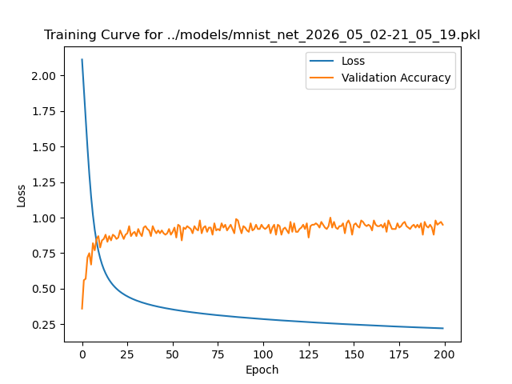

# MNIST Neural Network

Simple MNIST digit recognition neural network from scratch in Python with NumPy.
Models pickled in `./models`. Logs of training in `./logs`. Loss curve figures
with validation accuracy curves in `./models`. Unfortunately, the figure is
mislabelled, but I can't be bothered to fix it.



```py
class NeuralNetwork:
"""
A simple multi-layer perceptron (MLP) neural network classifier implemented
from scratch.

This class is designed to mimic a simplified/modified API of scikit-learn's
MLPClassifier. It supports multiple activation functions, mini-batch
stochastic gradient descent (SGD), L2 regularization, and early stopping.

Parameters
----------
layer_sizes : tuple of int, default=(784, 100, 100, 10)
    The number of neurons in each layer, including input and output layers.
    Example: (784, 100, 10) defines a network with 784 input features, one
    hidden layer of 100 neurons, and 10 output classes.

activation_function : str, default='relu'
    The activation function to use for all hidden layers. Options: -
    'identity': No transformation (linear) - 'logistic': Sigmoid function -
    'tanh': Hyperbolic tangent - 'relu': Rectified Linear Unit

alpha : float, default=1e-4
    L2 regularization (weight decay) strength. Higher values increase
    regularization. Set to 0 to disable regularization

batch_size : int or 'auto', default='auto'
    Mini-batch size for stochastic gradient descent. If 'auto', uses
    min(200, n_samples).

learning_rate : float, default=0.001
    Step size for weight updates during gradient descent.

max_iter : int, default=2000
    Maximum number of training epochs (full passes through the dataset).

tolerance : float, default=1e-4
    Minimum loss improvement required to continue training. Training stops
    if improvement is below this threshold for `n_iter_no_change`
    consecutive epochs.

n_iter_no_change : int, default=10
    Number of epochs with insufficient improvement before triggering early
    stopping.

Attributes
----------
weights : list of ndarray
    Learned weight matrices for each layer. weights[i] has shape (n_in,
    n_out).

biases : list of ndarray
    Learned bias vectors for each layer. biases[i] has shape (n_out,).

layer_sizes : tuple of int
    The architecture specification passed during initialization.

n_iter : int
    Actual number of epochs completed during training.

loss_curve : ndarray
    Training loss recorded after each epoch.

validation_scores : ndarray
    Validation accuracy scores recorded after each epoch, if tracking was
    enabled by passing `validation_data=(x_val, y_val)` to `fit()`.

activation_function, d_activation_function : callable
    The activation function and its derivative, selected from the global
    mappings.

activation_func_name : str
    Name of activation function passed during initialization.

Methods
-------
fit(x_train, y_train, validation_data=(x_val, y_val))
    Train the network using mini-batch SGD with optional early stopping. Set
    `validation_data`, otherwise accuracy scores will not be tracked in
    `validation_scores`.

predict(x)
    Predict class label for input x.

predict_proba(x)
    Return probability estimates for each class.

score(x_test, y_test)
    Compute mean classification accuracy on given data and labels.

Notes
-----
- Uses Xavier/Glorot initialization for logistic/tanh activations and He
    initialization for ReLU to promote stable gradient flow during training.
- Output layer uses softmax-like behavior via cross-entropy loss; for
    multi-class classification, ensure the final layer size matches the number
    of classes.
- Labels `y` must be provided as one-hot encoded vectors (shape (n_samples,
    n_classes)).
- Early stopping monitors training loss; for validation-based stopping, pass
    `validation_data=(x_val, y_val)` to `fit()`.
- No momentum or adaptive learning rates are implemented; this is vanilla
    SGD.

References
----------
.. [1] scikit-learn MLPClassifier:
    https://scikit-learn.org/stable/modules/generated/sklearn.neural_network.MLPClassifier.html

Examples
--------
>>> net = NeuralNetwork()
>>> # Load datasets
>>> train_images = load_mnist_images("dataset/train-images-idx3-ubyte")
>>> train_labels = load_mnist_labels("dataset/train-labels-idx1-ubyte")
>>> test_images = load_mnist_images("dataset/t10k-images-idx3-ubyte")
>>> test_labels = load_mnist_labels("dataset/t10k-labels-idx1-ubyte")
>>> # Format data
>>> x_train, y_train = format_mnist_data(train_images, train_labels)
>>> x_val, y_val = format_mnist_data(test_images, test_labels)
>>> net.fit(x_train, y_train, validation_data=(x_val, y_val))
>>> # Evaluate
>>> final_accuracy = net.score(X_test, y_test)
>>> predictions = net.predict(X_test)
>>> probabilities = net.predict_proba(X_test)
>>> # Plot training progress
>>> import matplotlib.pyplot as plt
>>> plt.plot(net.loss_curve, label="Loss")
>>> plt.plot(net.validation_scores, label="Accuracy of Test Dataset")
>>> plt.xlabel('Epoch'); plt.ylabel('Loss'); plt.title('Training Curve')
>>> plt.legend()
>>> plt.show()
"""
```

Copyright (C) 2024-2025 Jonah Spector

